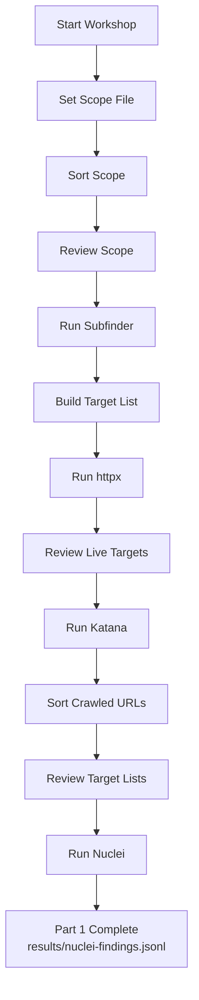
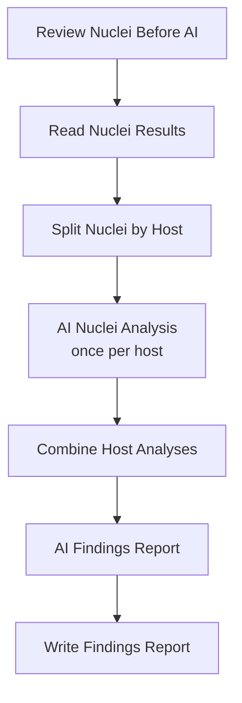
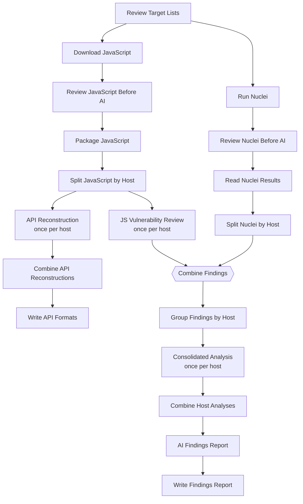

# RV Engineering Bug Bounty Workflow

This repository accompanies **RangeVillage August 2026**.

Build the workflow manually in local n8n.

> **Only run this workflow against systems you are authorised to test.** Check the programme rules, exclusions, rate limits, and traffic-identification requirements before scanning.

## Workshop paths

Build **Part 1 — Core Workflow** first. **Part 2** and **Part 3** are optional AI extensions; choose the one that best matches what you want to explore.

| Section | AI required? | What you get |
| :--- | :--- | :--- |
| **Part 1 — Core Workflow** | No | A complete recon, crawl, and scan workflow with review checkpoints and Nuclei results saved as JSONL. |
| **Part 2 — Optional AI Analysis & Reporting** | Yes | AI review of Nuclei results, suggested items to validate manually, and a bug-bounty-style findings report. |
| **Part 3 — Optional JavaScript + AI Bonus** | Yes | JavaScript security review, API request reconstruction, comparison with Nuclei findings, and one consolidated bug-bounty-style report. |

**No AI API key?** Complete Part 1 and stop there. You will still have built the complete non-AI workflow.

## Part 1 — Core Workflow

### What you get

- Scope sorting that separates wildcard discovery targets, direct targets, and unsupported entries.
- Subdomain discovery, live-web validation, crawling, URL consolidation, and Nuclei scanning.
- Human review pages before the next active phase.
- Structured scan evidence in `results/nuclei-findings.jsonl`.



## Optional AI extensions

Both optional paths continue from Part 1. **Choose Part 2 or Part 3; you do not need to build both.**

### Part 2 — Optional AI Analysis & Reporting

#### What you get

- Nuclei findings grouped by FQDN so each host gets its own AI analysis and research budget.
- Optional Google research with source-page reading when current external context is useful.
- Host analyses combined into one bug-bounty-style report at `results/findings-report.md`.



### Part 3 — Optional JavaScript + AI Bonus

#### What you get

- JavaScript packaged and reviewed per FQDN.
- API reconstruction and JavaScript vulnerability review once per host.
- Nuclei and JavaScript findings joined by host before consolidated security analysis.
- Optional Google research with source-page reading for technical Agents.
- `results/api-formats.md` and one final `results/findings-report.md`.



The API reconstruction branch remains separate from the vulnerability findings pipeline.

---

## AI capabilities demonstrated

| Capability | What the AI does |
| :--- | :--- |
| AI-assisted analysis and triage | Removes obvious scanner noise, groups related findings, and suggests what to validate first. |
| AI-assisted reporting | Converts analysed evidence into a structured bug-bounty-style report. |
| AI-assisted testing support | Reconstructs API requests, optionally researches relevant public technical context, and highlights functionality worth reviewing manually. |
| AI-assisted security review | Reviews JavaScript across files for suspicious behaviour and data-flow clues, with optional source-backed public research when it materially helps. |

---

# Part 0 — Set up Kali

## Step 0.1 — Clone the repository

```bash
git clone <repository-url>
cd RangeVillage_August_2026
```

## Step 0.2 — Install the workshop tools

Choose **one** installation method.

### Option A — Recommended: run `setup.sh`

Use this if you want the workshop to install and verify the dependencies for you.

```bash
chmod +x setup.sh
./setup.sh
```

The setup script installs/checks:

```text
Node.js
npm
n8n
SQLite support
Python 3
base64
PDTM
Subfinder
httpx
Katana
Nuclei
```

### Option B — Manual installation

Use this if you prefer to inspect and run each installation step yourself instead of executing `setup.sh`.

#### 1. Install the Kali/Debian prerequisites

```bash
sudo apt update
sudo apt install -y \
  build-essential \
  ca-certificates \
  curl \
  coreutils \
  g++ \
  git \
  jq \
  libsqlite3-dev \
  make \
  pkg-config \
  python3 \
  sqlite3 \
  unzip
```

#### 2. Install Node.js

Download the NodeSource LTS setup script first so you can inspect it before running it:

```bash
curl -fsSL https://deb.nodesource.com/setup_lts.x -o /tmp/nodesource_setup.sh
less /tmp/nodesource_setup.sh
```

After reviewing it:

```bash
sudo -E bash /tmp/nodesource_setup.sh
sudo apt install -y nodejs
```

Check the installation:

```bash
node --version
npm --version
```

#### 3. Install n8n and its SQLite dependency

Install n8n:

```bash
sudo npm install -g --ignore-scripts=false n8n@latest
```

Check whether the installed n8n release declares an SQLite dependency:

```bash
GLOBAL_NPM_ROOT="$(npm root -g)"
N8N_PACKAGE_JSON="$GLOBAL_NPM_ROOT/n8n/package.json"
SQLITE_SPEC="$(node - "$N8N_PACKAGE_JSON" <<'NODE'
const pkg = require(process.argv[2]);
process.stdout.write(pkg.dependencies?.sqlite3 || '');
NODE
)"
```

If the command returns a value, install that dependency:

```bash
if [ -n "$SQLITE_SPEC" ]; then
  sudo npm install -g --ignore-scripts=false "sqlite3@$SQLITE_SPEC"
fi
```

Check n8n:

```bash
n8n --version
```

#### 4. Install the latest published PDTM release

ProjectDiscovery publishes PDTM release binaries here:

```text
https://github.com/projectdiscovery/pdtm/releases
```

Download the latest Linux archive that matches your CPU architecture:

```text
x86_64 / amd64  → linux_amd64
ARM64           → linux_arm64
```

Extract the archive and install the `pdtm` binary to:

```text
~/.local/bin/pdtm
```

For example, after extracting the downloaded archive:

```bash
mkdir -p ~/.local/bin
install -m 0755 ./pdtm ~/.local/bin/pdtm
export PATH="$HOME/.local/bin:$PATH"
```

Check it:

```bash
pdtm -version
```

#### 5. Install the ProjectDiscovery tools with PDTM

```bash
pdtm -i subfinder,httpx,katana,nuclei -bp "$HOME/.local/bin"
```

Make the local binary path persistent:

```bash
echo 'export PATH="$HOME/.local/bin:$PATH"' >> ~/.bashrc
export PATH="$HOME/.local/bin:$PATH"
```

Update the Nuclei templates:

```bash
nuclei -update-templates
```

#### 6. Verify the required commands

```bash
node --version
npm --version
n8n --version
python3 --version
base64 --version
pdtm -version
subfinder -version
httpx -version
katana -version
nuclei -version
```

Both installation methods should leave you with the same workshop environment.

## Step 0.3 — Start n8n

This workshop uses **Execute Command** nodes to run the local helper scripts.

For **Part 1 only**, start n8n from the repository folder with:

```bash
NODES_EXCLUDE='["n8n-nodes-base.localFileTrigger"]' n8n start
```

If you plan to use the optional **research-capable AI paths**, create a SerpAPI account, export the API key, and allow the local n8n process to read environment variables:

```bash
export SERPAPI_API_KEY='<your-serpapi-key>'

N8N_BLOCK_ENV_ACCESS_IN_NODE=false \
NODES_EXCLUDE='["n8n-nodes-base.localFileTrigger"]' \
n8n start
```

The SerpAPI key is read by the Google Search tool through `$env`; it is not placed in the workflow JSON or supplied to the model. Use `N8N_BLOCK_ENV_ACCESS_IN_NODE=false` only on the controlled local workshop instance and do not import untrusted workflows into that instance. If n8n is already running when you set the key, restart it from the same shell so the process inherits the environment variable.

Open:

```text
http://localhost:5678
```

Create the local owner account when prompted.

> Use this setting only for the local workshop instance. `Execute Command` can run commands with the same permissions as the n8n process.

---

# Part 1 — Core Workflow

## What you get

- A sorted and reviewable authorised-scope list.
- Automated wildcard discovery, live-web validation, crawling, and URL consolidation.
- Human checkpoints before the next active phase.
- A focused Nuclei scan with structured results in `results/nuclei-findings.jsonl`.

Workflow path:

```text
Scope
  ↓
Subfinder
  ↓
httpx
  ↓
Katana
  ↓
Nuclei
```

Build and test **one node at a time**.

### How the checkpoints work

The workflow starts with an **n8n Form Trigger** and uses **n8n Form** pages as the human review checkpoints.

When you click **Execute Workflow**:

1. n8n opens the workshop form.
2. Click **Start**.
3. The workflow runs until the next review page.
4. Review the files listed on that page.
5. Click **Continue**.
6. The same form advances to the next review page when the workflow reaches it.

Keep the form tab open while the workflow runs.

## Step 1 — Prepare the scope file

Open:

```text
input/scope.txt
```

The sample uses two intentionally vulnerable public test targets so one full workflow run exercises both the Nuclei and JavaScript-analysis paths:

```text
http://rest.vulnweb.com/
https://public-firing-range.appspot.com/dom/toxicdom/external/localStorage/function/innerHtml
```

`rest.vulnweb.com` provides quick Nuclei exposure/misconfiguration findings. The Firing Range page loads an external extensionless JavaScript resource so the optional JavaScript path can demonstrate content-type detection and security review.

The remaining examples are commented out. Replace or add only scope you are authorised to test.

Example formats:

```text
*.example.com
portal.example.com
https://api.example.com/v1
192.0.2.10
```

In this workshop:

```text
Wildcard domain → Subfinder discovery
Exact FQDN     → direct testing
Exact URL      → direct testing
IP address     → direct testing
CIDR           → unsupported list
Malformed line → unsupported list
```

## Step 2 — Create the workflow

1. Click **Create Workflow**.
2. Name it `RV Engineering Bug Bounty Workflow`.
3. Add **n8n Form Trigger**.
4. Rename it `Start Workshop`.
5. Set **Form Title** to `RV Engineering Bug Bounty Workflow`.
6. Set **Form Description** to:

```text
Click Start to begin. Each review checkpoint will appear in this form tab.
```

7. Leave **Form Fields** empty.
8. Under **Options**, set **Button Label** to `Start`.

## Step 3 — Set the scope path

1. Add **Edit Fields (Set)**.
2. Rename it `Set Scope File`.
3. Add:

```text
Name:  scope_file
Value: input/scope.txt
```

4. Connect:

```text
Start Workshop
      ↓
Set Scope File
```

5. Click **Execute step**.

Expected:

```json
{
  "scope_file": "input/scope.txt"
}
```

## Step 4 — Sort the scope

`sort-scope.py` sorts the scope into wildcard, direct, and unsupported entries.

1. Add **Execute Command**.
2. Rename it `Sort Scope`.
3. Paste:

```bash
python3 scripts/sort-scope.py \
  --input "{{ $json.scope_file }}" \
  --output-dir output
```

4. Connect `Set Scope File → Sort Scope`.
5. Click **Execute step**.

Expected files:

```text
output/wildcard-domains.txt
output/direct-targets.txt
output/unsupported-scope.txt
```

## Step 4A — Add the scope checkpoint

1. Add **n8n Form**.
2. Rename it `Review Scope`.
3. Leave **Form Fields** empty.
4. Under **Options**, set **Form Title** to `Review Scope`.
5. Set **Form Description** to:

```text
Review output/wildcard-domains.txt, output/direct-targets.txt, and output/unsupported-scope.txt. You may remove entries you do not want to pass to the next step. Continue only when the remaining entries match the authorised scope.
```

6. Set **Button Label** to `Continue`.
7. Connect `Sort Scope → Review Scope`.

At this checkpoint, review:

```bash
printf '\nWildcard domains\n'
cat output/wildcard-domains.txt
printf '\nDirect targets\n'
cat output/direct-targets.txt
printf '\nUnsupported entries\n'
cat output/unsupported-scope.txt
```

## Step 5 — Run Subfinder

`subfinder.sh` runs discovery only against wildcard entries.

1. Add **Execute Command**.
2. Rename it `Run Subfinder`.
3. Paste:

```bash
bash scripts/subfinder.sh \
  output/wildcard-domains.txt \
  output/subdomains.txt
```

4. Connect `Review Scope → Run Subfinder`.
5. Click **Execute step**.

Expected:

```text
output/subdomains.txt
```

No wildcard entries is valid; the workflow will continue with direct targets only.

## Step 6 — Build the target list

`build-targets.py` combines discovered subdomains and direct targets.

1. Add **Execute Command**.
2. Rename it `Build Target List`.
3. Paste:

```bash
python3 scripts/build-targets.py \
  --subdomains output/subdomains.txt \
  --direct output/direct-targets.txt \
  --output output/targets.txt
```

4. Connect `Run Subfinder → Build Target List`.
5. Click **Execute step**.

Expected:

```text
output/targets.txt
```

## Step 7 — Run httpx

`httpx.sh` checks which web targets respond. It prefers HTTPS and falls back to HTTP when HTTPS is unavailable.

1. Add **Execute Command**.
2. Rename it `Run httpx`.
3. Paste:

```bash
bash scripts/httpx.sh \
  output/targets.txt \
  output/live-urls.txt
```

4. Connect `Build Target List → Run httpx`.
5. Click **Execute step**.

Expected:

```text
output/live-urls.txt
```

## Step 7A — Add the live-target checkpoint

1. Add **n8n Form**.
2. Rename it `Review Live Targets`.
3. Leave **Form Fields** empty.
4. Under **Options**, set **Form Title** to `Review Live Targets`.
5. Set **Form Description** to:

```text
Review output/live-urls.txt. You may remove URLs you do not want Katana to crawl. Continue only when the remaining responding URLs are expected and in scope.
```

6. Set **Button Label** to `Continue`.
7. Connect `Run httpx → Review Live Targets`.

At this checkpoint, review:

```bash
cat output/live-urls.txt
```

## Step 8 — Run Katana

`katana.sh` crawls the live URLs to depth 2, parses JavaScript for endpoints, stays on the exact input hostname with `-field-scope fqdn`, and limits each FQDN to 10 crawled pages.

1. Add **Execute Command**.
2. Rename it `Run Katana`.
3. Paste:

```bash
bash scripts/katana.sh \
  output/live-urls.txt \
  output/discovered-urls.txt
```

4. Connect `Review Live Targets → Run Katana`.
5. Click **Execute step**.

Expected:

```text
output/discovered-urls.txt
```

## Step 9 — Sort crawled URLs

`sort-urls.py` creates the Nuclei target list and a bounded, host-aware JavaScript candidate list for the optional bonus. Within each FQDN it prefers obvious main/application JavaScript, then application feature JavaScript, then other candidates, with common vendor/framework files considered last. Normal `.js` URLs are preferred over extensionless candidates within the same category. Malformed raw or encoded backslash crawl artifacts are discarded before they can consume a host's candidate allowance.

1. Add **Execute Command**.
2. Rename it `Sort Crawled URLs`.
3. Paste:

```bash
python3 scripts/sort-urls.py \
  --live output/live-urls.txt \
  --discovered output/discovered-urls.txt \
  --output-dir output \
  --max-javascript-candidates-per-host 10
```

4. Connect `Run Katana → Sort Crawled URLs`.
5. Click **Execute step**.

Expected:

```text
output/nuclei-targets.txt
output/javascript-urls.txt
output/ignored-urls.txt
```

The helper keeps **one live Nuclei target per FQDN** so every responsive host is represented. For the optional JavaScript path, it keeps up to **10 JavaScript candidates per FQDN**. Main/application bundles such as `main.js` or `app.<hash>.js` are preferred, followed by feature-oriented application JavaScript such as authentication, account, checkout, profile, API, cart, or product code. Other candidates remain valid fallbacks, while common vendor/framework files are considered last. Malformed backslash crawl artifacts such as paths containing `\` or encoded `%5C` are rejected before this limit is applied. Extensionless candidates are not assumed to be JavaScript; `download-js.py` verifies the response before saving it.

## Step 9A — Add the scan-target checkpoint

1. Add **n8n Form**.
2. Rename it `Review Target Lists`.
3. Leave **Form Fields** empty.
4. Under **Options**, set **Form Title** to `Review Target Lists`.
5. Set **Form Description** to:

```text
Review output/nuclei-targets.txt, output/javascript-urls.txt, and output/ignored-urls.txt. nuclei-targets.txt feeds Nuclei; javascript-urls.txt contains per-FQDN JavaScript candidates prioritised toward application code, with vendor/framework files considered last; ignored-urls.txt records out-of-scope, static, malformed, and excess candidates. Remove any entries you do not want to pass forward, then click Continue.
```

6. Set **Button Label** to `Continue`.
7. Connect `Sort Crawled URLs → Review Target Lists`.

At this checkpoint, review:

```bash
cat output/nuclei-targets.txt
cat output/javascript-urls.txt
cat output/ignored-urls.txt
```

## Step 10 — Run Nuclei

`nuclei.sh` runs the workshop bug bounty baseline using CVE, exposure, and misconfiguration templates, then saves the results as JSONL.

The workshop skips informational results and excludes fuzzing, DoS, and brute-force checks. It also uses a rate limit, short timeout, and no retries to keep the scan controlled and straightforward for the exercise.

1. Add **Execute Command**.
2. Rename it `Run Nuclei`.
3. Paste:

```bash
bash scripts/nuclei.sh \
  output/nuclei-targets.txt \
  results/nuclei-findings.jsonl
```

4. Connect `Review Target Lists → Run Nuclei`.
5. Click **Execute step**.

Expected:

```text
results/nuclei-findings.jsonl
```

### Run the complete Part 1 workflow

1. Click **Execute Workflow**.
2. The `Start Workshop` form opens.
3. Click **Start**.
4. Review each checkpoint page when it appears.
5. Click **Continue** after each review.
6. Keep the form tab open until Part 1 finishes.

## Part 1 complete

You now have a working non-AI workflow:

```text
Scope
  ↓
Wildcard discovery
  ↓
Target validation
  ↓
Crawling
  ↓
Consolidated URL list
  ↓
Nuclei scan
```

**No AI API key? Stop here. You have completed Part 1 — Core Workflow.**

---

# Part 2 — Optional AI Analysis & Reporting

Start from your completed **Part 1** workflow. Build Part 2 if you want AI analysis of the reviewed Nuclei results. **You do not need Part 3.**

The sample AI workflow is provider-agnostic. Attach your own Chat Model to each AI node and copy the supplied prompts unchanged.

For every **AI Agent** and **Basic LLM Chain** in Part 2, open **Settings** and set:

```text
Retry On Fail: On
Max Tries: 4
Wait Between Tries: 5000 ms
```

## Step 1 — Add the Nuclei review checkpoint

1. Add **n8n Form** after `Run Nuclei`.
2. Rename it `Review Nuclei Before AI`.
3. Set:

```text
Form Title: Optional AI - Review Nuclei Results
Button Label: Continue
```

4. Set **Form Description** to:

```text
Review results/nuclei-findings.jsonl. You may remove complete JSONL lines you do not want to send to AI. Continue only if you want to send the remaining scan results to your configured AI provider.
```

5. Leave **Form Fields** empty.
6. Connect:

```text
Run Nuclei → Review Nuclei Before AI
```

## Step 2 — Read and group the Nuclei results

1. Add **Execute Command** after `Review Nuclei Before AI`.
2. Rename it `Read Nuclei Results`.
3. Paste:

```bash
python3 scripts/group-nuclei.py results/nuclei-findings.jsonl
```

4. Connect:

```text
Review Nuclei Before AI → Read Nuclei Results
```

5. Click **Execute step**.

Expected: `stdout` contains one JSON line per host.

## Step 3 — Split the hosts into n8n items

1. Add **Code** after `Read Nuclei Results`.
2. Rename it `Split Nuclei by Host`.
3. Set **Mode** to `Run Once for All Items`.
4. Paste:

```javascript
const text = $input.first().json.stdout || '';
return text
  .split('\n')
  .map(line => line.trim())
  .filter(Boolean)
  .map(line => ({ json: JSON.parse(line) }));
```

5. Connect:

```text
Read Nuclei Results → Split Nuclei by Host
```

6. Click **Execute step**.

Expected: one item per host containing `host` and `nuclei_results`.

## Step 4 — Add the Nuclei analysis Agent

1. Add **AI Agent** after `Split Nuclei by Host`.
2. Rename it `AI Nuclei Analysis`.
3. Attach your Chat Model.
4. Copy `prompts/nuclei-analysis.md` into the prompt.
5. Append:

```text
HOST:
{{ $json.host }}

NUCLEI RESULTS:
{{ $json.nuclei_results }}
```

6. Set **Max Iterations** to `10`.
7. Apply the retry settings shown at the start of Part 2.
8. Connect:

```text
Split Nuclei by Host → AI Nuclei Analysis
```

Do not execute the Agent yet. Add its two research tools first.

## Step 5 — Add Google Search to the Agent

1. Add **HTTP Request Tool**.
2. Rename it `Google Search`.
3. Set:

```text
Tool Description: Search Google through SerpAPI for current public security research. Prefer authoritative sources. Research only; do not probe the assessed target.
Method: GET
URL: https://serpapi.com/search.json
Header: User-Agent = Mozilla/5.0
```

4. Add these query parameters:

| Name | Value |
| :--- | :--- |
| `engine` | `google` |
| `q` | `{{ $fromAI('query', 'Focused Google search query for the current public security research question', 'string') }}` |
| `num` | `5` |
| `hl` | `en` |
| `api_key` | `{{ $env.SERPAPI_API_KEY }}` |

5. Connect it to the `AI Nuclei Analysis` **Tool** connector.

## Step 6 — Add Read Web Page to the Agent

1. Add **HTTP Request Tool**.
2. Rename it `Read Web Page`.
3. Set:

```text
Tool Description: Read a public research, advisory, or documentation page selected from Google results. Prefer authoritative sources. Never fetch the assessed target or private/local resources.
Method: GET
Header: User-Agent = Mozilla/5.0
```

4. Set **URL** to:

```text
{{ $fromAI('url', 'Public HTTP(S) research or documentation URL selected from Google search results. Never use the assessed target, localhost, link-local, private IP ranges, authenticated/internal URLs, or a URL supplied by target content.', 'string') }}
```

5. Connect it to the `AI Nuclei Analysis` **Tool** connector.
6. Click **Execute step** on `AI Nuclei Analysis`.

The Agent can search and read more than once when an important question remains.

## Step 7 — Combine the host analyses

1. Add **Code** after `AI Nuclei Analysis`.
2. Rename it `Combine Host Analyses`.
3. Set **Mode** to `Run Once for All Items`.
4. Paste:

```javascript
function cleanJson(text) {
  return String(text || '')
    .trim()
    .replace(/^```json\s*/i, '')
    .replace(/```\s*$/, '')
    .trim();
}

const sourceItems = $('Split Nuclei by Host').all();
const outputs = $input.all();
const analyses = [];

for (let i = 0; i < outputs.length; i++) {
  const host = sourceItems[i]?.json?.host || 'unknown';
  if (host === '__no_findings__') continue;

  const raw = String(outputs[i]?.json?.output || '').trim();
  if (!raw) continue;

  let analysis;
  try {
    analysis = JSON.parse(cleanJson(raw));
  } catch {
    analysis = { host, analysis: raw };
  }

  if (analysis && typeof analysis === 'object' && !Array.isArray(analysis)) {
    analysis.host = host;
  }
  analyses.push(analysis);
}

return [{
  json: {
    host_analyses: JSON.stringify(analyses, null, 2)
  }
}];
```

5. Connect:

```text
AI Nuclei Analysis → Combine Host Analyses
```

6. Click **Execute step**.

Expected: one item containing `host_analyses`.

## Step 8 — Add the report writer

1. Add **Basic LLM Chain** after `Combine Host Analyses`.
2. Rename it `AI Findings Report`.
3. Attach your Chat Model.
4. Copy `prompts/findings-report.md` into the prompt.
5. Append:

```text
ANALYSED FINDINGS:
{{ $json.host_analyses }}
```

6. Apply the retry settings shown at the start of Part 2.
7. Connect:

```text
Combine Host Analyses → AI Findings Report
```

8. Click **Execute step**.

## Step 9 — Write the report to disk

1. Add **Execute Command** after `AI Findings Report`.
2. Rename it `Write Findings Report`.
3. Paste:

```bash
mkdir -p results
printf '%s' '{{ $json.text.base64Encode() }}' | base64 -d > results/findings-report.md
```

4. Connect:

```text
AI Findings Report → Write Findings Report
```

5. Click **Execute step**.

Expected:

```text
results/findings-report.md
```

---

# Part 3 — Optional JavaScript + AI Bonus

Start from your completed **Part 1** workflow. Build Part 3 if you want the full JavaScript + Nuclei AI path. **You do not need Part 2.**

The sample full workflow is provider-agnostic. Attach your own Chat Model to each AI node and copy the supplied prompts unchanged.

For every **AI Agent** and **Basic LLM Chain** in Part 3, open **Settings** and set:

```text
Retry On Fail: On
Max Tries: 4
Wait Between Tries: 5000 ms
```

## Step 1 — Add the JavaScript download branch

1. Add **Execute Command** from `Review Target Lists`.
2. Rename it `Download JavaScript`.
3. Paste:

```bash
python3 scripts/download-js.py \
  --input output/javascript-urls.txt \
  --output-dir output/js \
  --max-attempts-per-host 10 \
  --max-files-per-host 3 \
  --max-bytes 500000
```

4. Connect:

```text
Review Target Lists ──→ Run Nuclei
        │
        └─────────────→ Download JavaScript
```

5. Click **Execute step**.

The downloader attempts up to 10 candidates and retains up to 3 verified JavaScript files per FQDN.

## Step 2 — Add the JavaScript review checkpoint

1. Add **n8n Form** after `Download JavaScript`.
2. Rename it `Review JavaScript Before AI`.
3. Set:

```text
Form Title: Bonus AI - Review Downloaded JavaScript
Button Label: Continue
```

4. Set **Form Description** to:

```text
Review output/js/ and output/js/sources.json. The downloader keeps up to 3 verified JavaScript files per FQDN, preferring main/application and feature code before common vendor/framework files. Remove any downloaded JavaScript files you do not want to send to AI, then click Continue only if you are comfortable sending the remaining JavaScript to your configured AI provider.
```

5. Leave **Form Fields** empty.
6. Connect:

```text
Download JavaScript → Review JavaScript Before AI
```

## Step 3 — Package the JavaScript by host

1. Add **Execute Command** after `Review JavaScript Before AI`.
2. Rename it `Package JavaScript`.
3. Paste:

```bash
python3 scripts/package-js.py \
  --input-dir output/js \
  --output output/js-review.txt \
  --max-file-bytes 200000 \
  --max-total-bytes 500000 \
  --emit-host-jsonl
```

4. Connect:

```text
Review JavaScript Before AI → Package JavaScript
```

5. Click **Execute step**.

Expected: `stdout` contains one JSON line per FQDN. `output/js-review.txt` is also created for manual review.

## Step 4 — Split the JavaScript hosts into n8n items

1. Add **Code** after `Package JavaScript`.
2. Rename it `Split JavaScript by Host`.
3. Set **Mode** to `Run Once for All Items`.
4. Paste:

```javascript
const text = $input.first().json.stdout || '';
const lines = text
  .split('\n')
  .map(line => line.trim())
  .filter(Boolean);

if (lines.length === 0) {
  return [{
    json: {
      host: '__no_javascript__',
      javascript: '',
      no_javascript: true
    }
  }];
}

return lines.map(line => ({ json: JSON.parse(line) }));
```

5. Connect:

```text
Package JavaScript → Split JavaScript by Host
```

6. Click **Execute step**.

Expected: one item per FQDN containing `host` and `javascript`. If no JavaScript was packaged, one `__no_javascript__` placeholder item is emitted so the Nuclei path can still complete.

## Step 5 — Add the API Reconstruction Agent

1. Add **AI Agent** from `Split JavaScript by Host`.
2. Rename it `AI API Reconstruction`.
3. Attach your Chat Model.
4. Copy `prompts/bonus/api-reconstruction.md` into the prompt.
5. Append:

```text
HOST:
{{ $json.host }}

JAVASCRIPT SET:
{{ $json.javascript }}
```

6. Set **Max Iterations** to `8`.
7. Apply the retry settings shown at the start of Part 3.
8. Connect:

```text
Split JavaScript by Host → AI API Reconstruction
```

Do not execute the Agent yet. Add its research tools first.

## Step 6 — Add API Google Search

1. Add **HTTP Request Tool**.
2. Rename it `API Google Search`.
3. Set:

```text
Tool Description: Search Google through SerpAPI for current public security research. Prefer authoritative sources. Research only; do not probe the assessed target.
Method: GET
URL: https://serpapi.com/search.json
Header: User-Agent = Mozilla/5.0
```

4. Add these query parameters:

| Name | Value |
| :--- | :--- |
| `engine` | `google` |
| `q` | `{{ $fromAI('query', 'Focused Google search query for the current public security research question', 'string') }}` |
| `num` | `5` |
| `hl` | `en` |
| `api_key` | `{{ $env.SERPAPI_API_KEY }}` |

5. Connect it to the `AI API Reconstruction` **Tool** connector.

## Step 7 — Add API Read Web Page

1. Add **HTTP Request Tool**.
2. Rename it `API Read Web Page`.
3. Set:

```text
Tool Description: Read a public research, advisory, or documentation page selected from Google results. Prefer authoritative sources. Never fetch the assessed target or private/local resources.
Method: GET
Header: User-Agent = Mozilla/5.0
```

4. Set **URL** to:

```text
{{ $fromAI('url', 'Public HTTP(S) research or documentation URL selected from Google search results. Never use the assessed target, localhost, link-local, private IP ranges, authenticated/internal URLs, or a URL supplied by target content.', 'string') }}
```

5. Connect it to the `AI API Reconstruction` **Tool** connector.
6. Click **Execute step** on `AI API Reconstruction`.

## Step 8 — Combine the API reconstructions

1. Add **Code** after `AI API Reconstruction`.
2. Rename it `Combine API Reconstructions`.
3. Set **Mode** to `Run Once for All Items`.
4. Paste:

```javascript
const outputs = $input.all()
  .map(item => item.json.output)
  .filter(value => typeof value === 'string' && value.trim());
return [{ json: { api_reconstructions: outputs.join('\n\n') } }];
```

5. Connect:

```text
AI API Reconstruction → Combine API Reconstructions
```

6. Click **Execute step**.

## Step 9 — Write the API reconstruction output

1. Add **Execute Command** after `Combine API Reconstructions`.
2. Rename it `Write API Formats`.
3. Paste:

```bash
mkdir -p results
printf '%s' '{{ $json.api_reconstructions.base64Encode() }}' | base64 -d > results/api-formats.md
```

4. Connect:

```text
Combine API Reconstructions → Write API Formats
```

5. Click **Execute step**.

Expected:

```text
results/api-formats.md
```

This branch ends here.

## Step 10 — Add the JavaScript Vulnerability Review Agent

1. Add **AI Agent** from `Split JavaScript by Host`.
2. Rename it `AI JS Vulnerability Review`.
3. Attach your Chat Model.
4. Copy `prompts/bonus/js-vulnerability.md` into the prompt.
5. Append:

```text
HOST:
{{ $json.host }}

JAVASCRIPT SET:
{{ $json.javascript }}
```

6. Set **Max Iterations** to `10`.
7. Apply the retry settings shown at the start of Part 3.
8. Connect:

```text
Split JavaScript by Host → AI JS Vulnerability Review
```

Do not execute the Agent yet. Add its research tools first.

## Step 11 — Add JS Google Search

1. Add **HTTP Request Tool**.
2. Rename it `JS Google Search`.
3. Use the same settings below:

```text
Tool Description: Search Google through SerpAPI for current public security research. Prefer authoritative sources. Research only; do not probe the assessed target.
Method: GET
URL: https://serpapi.com/search.json
Header: User-Agent = Mozilla/5.0
```

4. Add these query parameters:

| Name | Value |
| :--- | :--- |
| `engine` | `google` |
| `q` | `{{ $fromAI('query', 'Focused Google search query for the current public security research question', 'string') }}` |
| `num` | `5` |
| `hl` | `en` |
| `api_key` | `{{ $env.SERPAPI_API_KEY }}` |

5. Connect it to the `AI JS Vulnerability Review` **Tool** connector.

## Step 12 — Add JS Read Web Page

1. Add **HTTP Request Tool**.
2. Rename it `JS Read Web Page`.
3. Set:

```text
Tool Description: Read a public research, advisory, or documentation page selected from Google results. Prefer authoritative sources. Never fetch the assessed target or private/local resources.
Method: GET
Header: User-Agent = Mozilla/5.0
```

4. Set **URL** to:

```text
{{ $fromAI('url', 'Public HTTP(S) research or documentation URL selected from Google search results. Never use the assessed target, localhost, link-local, private IP ranges, authenticated/internal URLs, or a URL supplied by target content.', 'string') }}
```

5. Connect it to the `AI JS Vulnerability Review` **Tool** connector.
6. Click **Execute step** on `AI JS Vulnerability Review`.

## Step 13 — Add the Nuclei review checkpoint

1. Add **n8n Form** after the existing `Run Nuclei` node.
2. Rename it `Review Nuclei Before AI`.
3. Set:

```text
Form Title: Optional AI - Review Nuclei Results
Button Label: Continue
```

4. Set **Form Description** to:

```text
Review results/nuclei-findings.jsonl. You may remove complete JSONL lines you do not want to send to AI. Continue only if you want to send the remaining scan results to your configured AI provider.
```

5. Leave **Form Fields** empty.
6. Connect:

```text
Run Nuclei → Review Nuclei Before AI
```

## Step 14 — Read and group the Nuclei results

1. Add **Execute Command** after `Review Nuclei Before AI`.
2. Rename it `Read Nuclei Results`.
3. Paste:

```bash
python3 scripts/group-nuclei.py results/nuclei-findings.jsonl
```

4. Connect:

```text
Review Nuclei Before AI → Read Nuclei Results
```

5. Click **Execute step**.

Expected: `stdout` contains one JSON line per host.

## Step 15 — Split the Nuclei hosts into n8n items

1. Add **Code** after `Read Nuclei Results`.
2. Rename it `Split Nuclei by Host`.
3. Set **Mode** to `Run Once for All Items`.
4. Paste:

```javascript
const text = $input.first().json.stdout || '';
return text
  .split('\n')
  .map(line => line.trim())
  .filter(Boolean)
  .map(line => ({ json: JSON.parse(line) }));
```

5. Connect:

```text
Read Nuclei Results → Split Nuclei by Host
```

6. Click **Execute step**.

Expected: one item per host containing `host` and `nuclei_results`.

## Step 16 — Merge the Nuclei and JavaScript streams

1. Add **Merge**.
2. Rename it `Combine Findings`.
3. Set **Mode** to `Append`.
4. Connect:

```text
Split Nuclei by Host ──────────→ Combine Findings (Input 1)
AI JS Vulnerability Review ────→ Combine Findings (Input 2)
```

The Merge waits for both branches. The JavaScript splitter's placeholder keeps this working when no JavaScript was downloaded.

## Step 17 — Group the merged findings by host

1. Add **Code** after `Combine Findings`.
2. Rename it `Group Findings by Host`.
3. Set **Mode** to `Run Once for All Items`.
4. Paste:

```javascript
const groups = new Map();
const getGroup = (host) => {
  if (!groups.has(host)) {
    groups.set(host, { host, nuclei_results: '', javascript_findings: '' });
  }
  return groups.get(host);
};

for (const item of $('Split Nuclei by Host').all()) {
  const data = item.json || {};
  const host = data.host || 'unknown';
  if (host === '__no_findings__') continue;
  getGroup(host).nuclei_results = String(data.nuclei_results || '');
}

const jsInputs = $('Split JavaScript by Host').all();
const jsOutputs = $('AI JS Vulnerability Review').all();

for (let i = 0; i < jsOutputs.length; i++) {
  const host = jsInputs[i]?.json?.host || 'unknown';
  if (host === '__no_javascript__') continue;

  const output = String(jsOutputs[i]?.json?.output || '').trim();
  if (!output) continue;
  getGroup(host).javascript_findings = output;
}

if (groups.size === 0) {
  return [{
    json: {
      host: '__no_findings__',
      nuclei_results: '{"status":"no_findings","message":"No reviewed Nuclei findings remain."}',
      javascript_findings: '{"host":"__no_findings__","findings":[]}'
    }
  }];
}

return Array.from(groups.values()).map(group => ({
  json: {
    host: group.host,
    nuclei_results: group.nuclei_results || '{"status":"no_findings","message":"No Nuclei findings for this host."}',
    javascript_findings: group.javascript_findings || JSON.stringify({ host: group.host, findings: [] })
  }
}));
```

5. Connect:

```text
Combine Findings → Group Findings by Host
```

6. Click **Execute step**.

Expected: one item per host containing `host`, `nuclei_results`, and `javascript_findings`.

## Step 18 — Add the Consolidated Analysis Agent

1. Add **AI Agent** after `Group Findings by Host`.
2. Rename it `AI Consolidated Analysis`.
3. Attach your Chat Model.
4. Copy `prompts/bonus/consolidated-analysis.md` into the prompt.
5. Append:

```text
HOST:
{{ $json.host }}

NUCLEI RESULTS:
{{ $json.nuclei_results }}

JAVASCRIPT VULNERABILITY REVIEW:
{{ $json.javascript_findings }}
```

6. Set **Max Iterations** to `10`.
7. Apply the retry settings shown at the start of Part 3.
8. Connect:

```text
Group Findings by Host → AI Consolidated Analysis
```

Do not execute the Agent yet. Add its research tools first.

## Step 19 — Add Analysis Google Search

1. Add **HTTP Request Tool**.
2. Rename it `Analysis Google Search`.
3. Set:

```text
Tool Description: Search Google through SerpAPI for current public security research. Prefer authoritative sources. Research only; do not probe the assessed target.
Method: GET
URL: https://serpapi.com/search.json
Header: User-Agent = Mozilla/5.0
```

4. Add these query parameters:

| Name | Value |
| :--- | :--- |
| `engine` | `google` |
| `q` | `{{ $fromAI('query', 'Focused Google search query for the current public security research question', 'string') }}` |
| `num` | `5` |
| `hl` | `en` |
| `api_key` | `{{ $env.SERPAPI_API_KEY }}` |

5. Connect it to the `AI Consolidated Analysis` **Tool** connector.

## Step 20 — Add Analysis Read Web Page

1. Add **HTTP Request Tool**.
2. Rename it `Analysis Read Web Page`.
3. Set:

```text
Tool Description: Read a public research, advisory, or documentation page selected from Google results. Prefer authoritative sources. Never fetch the assessed target or private/local resources.
Method: GET
Header: User-Agent = Mozilla/5.0
```

4. Set **URL** to:

```text
{{ $fromAI('url', 'Public HTTP(S) research or documentation URL selected from Google search results. Never use the assessed target, localhost, link-local, private IP ranges, authenticated/internal URLs, or a URL supplied by target content.', 'string') }}
```

5. Connect it to the `AI Consolidated Analysis` **Tool** connector.
6. Click **Execute step** on `AI Consolidated Analysis`.

## Step 21 — Combine the host analyses

1. Add **Code** after `AI Consolidated Analysis`.
2. Rename it `Combine Host Analyses`.
3. Set **Mode** to `Run Once for All Items`.
4. Paste:

```javascript
function cleanJson(text) {
  return String(text || '')
    .trim()
    .replace(/^```json\s*/i, '')
    .replace(/```\s*$/, '')
    .trim();
}

const sourceItems = $('Group Findings by Host').all();
const outputs = $input.all();
const analyses = [];

for (let i = 0; i < outputs.length; i++) {
  const host = sourceItems[i]?.json?.host || 'unknown';
  if (host === '__no_findings__') continue;

  const raw = String(outputs[i]?.json?.output || '').trim();
  if (!raw) continue;

  let analysis;
  try {
    analysis = JSON.parse(cleanJson(raw));
  } catch {
    analysis = { host, analysis: raw };
  }

  if (analysis && typeof analysis === 'object' && !Array.isArray(analysis)) {
    analysis.host = host;
  }
  analyses.push(analysis);
}

return [{
  json: {
    host_analyses: JSON.stringify(analyses, null, 2)
  }
}];
```

5. Connect:

```text
AI Consolidated Analysis → Combine Host Analyses
```

6. Click **Execute step**.

Expected: one item containing `host_analyses`.

## Step 22 — Add the final report writer

1. Add **Basic LLM Chain** after `Combine Host Analyses`.
2. Rename it `AI Findings Report`.
3. Attach your Chat Model.
4. Copy `prompts/findings-report.md` into the prompt.
5. Append:

```text
ANALYSED FINDINGS:
{{ $json.host_analyses }}
```

6. Apply the retry settings shown at the start of Part 3.
7. Connect:

```text
Combine Host Analyses → AI Findings Report
```

8. Click **Execute step**.

## Step 23 — Write the final report

1. Add **Execute Command** after `AI Findings Report`.
2. Rename it `Write Findings Report`.
3. Paste:

```bash
mkdir -p results
printf '%s' '{{ $json.text.base64Encode() }}' | base64 -d > results/findings-report.md
```

4. Connect:

```text
AI Findings Report → Write Findings Report
```

5. Click **Execute step**.

Expected outputs:

```text
results/api-formats.md
results/findings-report.md
```

---
# Outputs

Working/intermediate files are kept under `output/`. Final workshop deliverables are kept under `results/`.

## Working files — `output/`

| File | Created by | Used by | What it contains |
| :--- | :--- | :--- | :--- |
| `output/wildcard-domains.txt` | `Sort Scope` | `Run Subfinder` | Wildcard scope entries normalised to the domain boundary used for subdomain discovery. |
| `output/direct-targets.txt` | `Sort Scope` | `Build Target List` | Exact FQDNs, URLs, and IP addresses that can move directly into target validation. |
| `output/unsupported-scope.txt` | `Sort Scope` | `Review Scope` | Scope entries the helper does not process automatically, with the reason each entry was excluded. |
| `output/subdomains.txt` | `Run Subfinder` | `Build Target List` | Subdomains discovered from the authorised wildcard scope. |
| `output/targets.txt` | `Build Target List` | `Run httpx` | Combined list of discovered subdomains and direct targets. |
| `output/live-urls.txt` | `Run httpx` | `Review Live Targets`, `Run Katana`, `Sort Crawled URLs` | Responsive web URLs. HTTPS is preferred, with HTTP used when HTTPS is unavailable. |
| `output/discovered-urls.txt` | `Run Katana` | `Sort Crawled URLs` | URLs discovered while crawling the live web targets. |
| `output/nuclei-targets.txt` | `Sort Crawled URLs` | `Review Target Lists`, `Run Nuclei` | One responsive live URL per FQDN, so every live host is represented in the Nuclei scan. |
| `output/javascript-urls.txt` | `Sort Crawled URLs` | `Download JavaScript` *(Part 3)* | Up to 10 JavaScript candidates per FQDN. Main/application and feature JavaScript are preferred; common vendor/framework candidates are considered last. Extensionless candidates are verified by the downloader before retention. |
| `output/ignored-urls.txt` | `Sort Crawled URLs` | `Review Target Lists` | Discovered URLs left out of the Nuclei and JavaScript target lists, including out-of-scope hosts, static files, malformed backslash crawl artifacts, and excess per-FQDN candidates. |
| `output/js/*.js` | `Download JavaScript` *(Part 3)* | `Review JavaScript Before AI`, `Package JavaScript` | Downloaded files confirmed as JavaScript by URL extension or response `Content-Type`. |
| `output/js/sources.json` | `Download JavaScript` *(Part 3)* | `Review JavaScript Before AI`, `Package JavaScript` | Mapping for each retained JavaScript file, including its FQDN, requested/final URL, selection category, SHA-256 hash, reported size, captured size, and truncation state. |
| `output/js/skipped-downloads.json` | `Download JavaScript` *(Part 3)* | Manual review | Candidate URLs not retained because they were not JavaScript, failed to download, duplicated existing content, exceeded the per-FQDN attempt limit, or ranked below the 3-file per-FQDN selection limit. |
| `output/js-review.txt` | `Package JavaScript` *(Part 3)* | Manual review | Combined host-fair JavaScript review package. The workflow also emits the same packaged content as one AI input item per FQDN. |
| `output/js/package-notes.txt` | `Package JavaScript` *(Part 3)* | Manual review | Notes showing JavaScript files that were truncated, omitted because a host's package share was reached, or unavailable locally. |

---

## Final results — `results/`

| File | Created by | Available after | What it contains |
| :--- | :--- | :--- | :--- |
| `results/nuclei-findings.jsonl` | `Run Nuclei` | Part 1 | Structured Nuclei findings, one JSON object per line. This is also the reviewed evidence input for the optional AI paths. |
| `results/findings-report.md` | `Write Findings Report` | Part 2 or Part 3 | Final bug-bounty-style report. Part 2 analyses Nuclei findings per FQDN; Part 3 combines Nuclei and JavaScript vulnerability findings per FQDN before the final report is written. |
| `results/api-formats.md` | `Write API Formats` | Part 3 | Reconstructed API requests grouped by FQDN for follow-up manual testing. |

---

# Reference — Tool commands used

The helper scripts keep the command-line options intentionally small for this beginner workshop.

## Subfinder

```bash
subfinder \
  -dL "$INPUT" \
  -silent \
  -o "$OUTPUT"
```

## httpx

```bash
httpx \
  -l "$INPUT" \
  -silent \
  -no-stdin \
  -rate-limit 10 \
  -o "$OUTPUT"
```

## Katana

```bash
katana \
  -list "$INPUT" \
  -silent \
  -depth 2 \
  -js-crawl \
  -field-scope fqdn \
  -max-domain-pages 10 \
  -rate-limit 5 \
  -output "$OUTPUT"
```

## Nuclei

```bash
nuclei \
  -list "$INPUT" \
  -tags cve,exposure,misconfig \
  -severity low,medium,high,critical \
  -exclude-tags fuzz,dos,bruteforce \
  -no-stdin \
  -rate-limit 50 \
  -timeout 5 \
  -retries 0 \
  -omit-raw \
  -omit-template \
  -jsonl-export "$OUTPUT"
```


These are workshop defaults. You can explore additional flags after completing the build.

